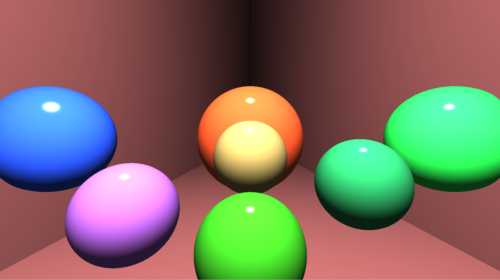
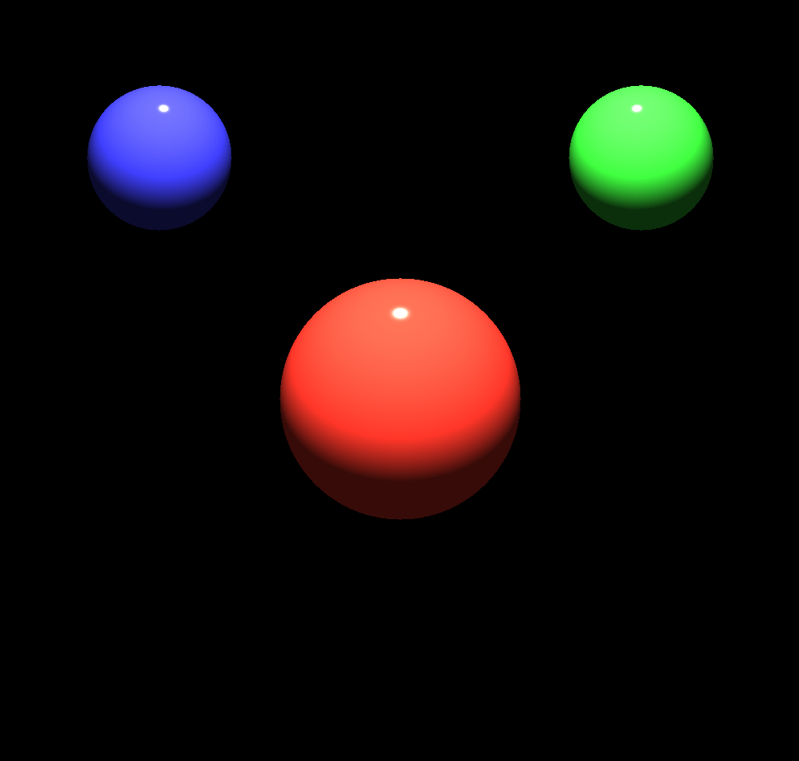

# Ray Tracer

Ray tracing is used to render spheres. **Phong shading** is used to light and shade spheres based on the positioning of the light source and objects.

## To do:
1. Add reflection/refraction
2. Add adjustable camera

## Attempt 1
Perspective distortion:

## Attempt 2
Fixed perspective distorition using transformation matrix:

